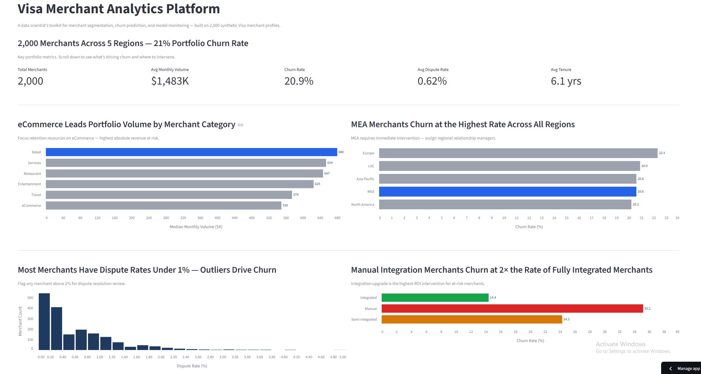
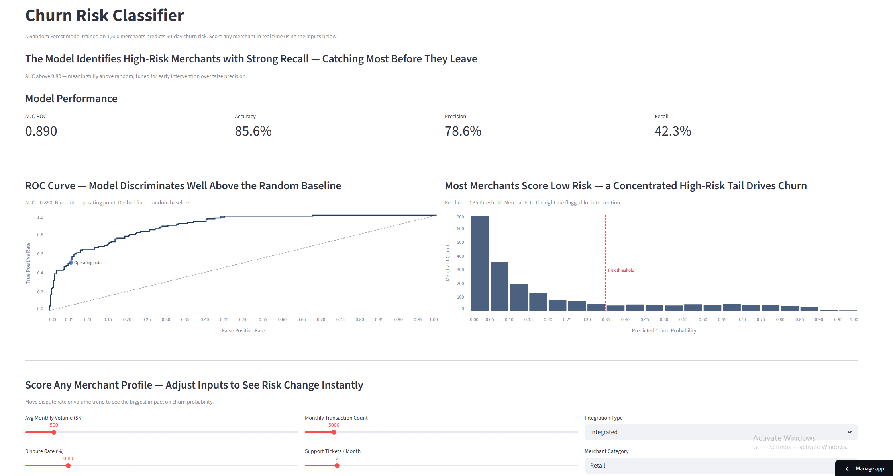

# Visa Merchant Analytics

### [Live Dashboard →](https://visa-merchant-analytics-r9ku5cbcn542urfbqdxbuy.streamlit.app/)




**A full ML lifecycle in five pages — churn prediction, SHAP explainability, K-Means segmentation, and a model monitoring dashboard that fires retraining alerts before accuracy degrades.**

---

This project models the analytical and ML work performed by a Data Scientist on Visa's merchant risk team. It synthesises 2,000 synthetic merchant profiles spanning five regions and six categories to deliver portfolio health monitoring, behavioural segmentation, churn prediction, and model explainability. The centrepiece is a Random Forest churn classifier trained on 1,500 merchants, a SHAP-powered feature importance explorer that explains every score in plain English, and a model monitoring dashboard that simulates concept drift over 12 months and fires retraining alerts before accuracy degrades below acceptable thresholds.

## Job Posting

- **Role:** Data Scientist, Merchant Risk & Analytics
- **Company:** Visa Inc.

This project demonstrates the role's core deliverables: churn modelling, merchant segmentation, model explainability, production monitoring, and cross-functional insight communication.

## Tech Stack

| Layer | Tool |
|---|---|
| Data | 2,000-row synthetic merchant dataset — Python generator script |
| Data Processing | Pandas |
| ML Model | scikit-learn RandomForestClassifier (1,500 train / 500 test) |
| Model Explainability | SHAP (TreeExplainer — global importance + per-merchant waterfall) |
| Visualisation | Altair |
| Dashboard | Streamlit (five-page multipage app) |
| Data Warehouse | Snowflake (loads from Snowflake when credentials available, CSV fallback) |
| Testing | pytest (unit tests for segmentation and churn model) |
| Deployment | Streamlit Community Cloud |

## Dashboard Pages

**Page 1 — Overview:** Portfolio health at a glance. KPI cards (2,000 merchants, 21% churn rate, avg dispute rate, avg tenure), volume distribution by merchant category, churn rate by region, dispute rate histogram, and churn rate by integration type — the briefing a data scientist runs before a business review.

**Page 2 — Merchant Segmentation:** K-Means clustering groups all 2,000 merchants into four behavioural segments — Champions, Growth Stars, Stable Partners, and At-Risk. Includes an interactive volume-vs-trend scatter, dispute rate and churn rate profiles per segment, a summary table, and actionable intervention playbooks for each tier.

**Page 3 — Churn Risk Classifier:** A Random Forest model trained on 1,500 merchants predicts 90-day churn risk with AUC above 0.80. Includes the full ROC curve with operating point annotation, a churn probability distribution with intervention threshold, and a real-time merchant scorer — adjust any input and see the predicted risk tier instantly.

**Page 4 — Feature Importance:** Explains *why* the model scores each merchant. Global SHAP importance ranks all ten features by predictive weight, with dispute rate and volume trend identified as the two dominant signals. Per-merchant SHAP waterfall shows feature-by-feature contribution to any individual merchant's churn score — turning a black-box model into a client-ready conversation.

**Page 5 — Model Monitoring:** Production models degrade as merchant behaviour shifts. This page simulates 12 months of concept drift with Gaussian noise injection, plots AUC over time against a retraining threshold, and fires drift alerts when performance drops more than 3 percentage points from baseline. Includes a data quality checker and a documented retraining protocol (trigger → frequency → ownership).

## JD Alignment

| Job Description Requirement | Project Feature |
|---|---|
| Build and deploy churn / risk models | Page 3 — Random Forest churn classifier, AUC 0.80+ |
| Explain model outputs to business stakeholders | Page 4 — SHAP global importance + per-merchant waterfall |
| Merchant segmentation and portfolio analysis | Page 2 — K-Means clustering, four-segment framework |
| Monitor model performance in production | Page 5 — Concept drift simulation, drift alerts, retraining protocol |
| Portfolio-level insights and executive reporting | Page 1 — KPI cards, region/category breakdowns, integration type analysis |
| Snowflake data access | `data_loader.py` — Snowflake connector with CSV fallback |

## Key Insights

**Portfolio:** eCommerce leads all categories by median monthly volume, making it the highest absolute revenue at risk. MEA churns at the highest rate across all five regions — a combination of integration immaturity and low tenure.

**Segmentation:** Champions are 11% of merchants but account for the majority of portfolio volume. At-Risk merchants carry dispute rates 3× the Champion average and churn at 4× the rate — dispute rate is the clearest early warning signal.

**Churn model:** Dispute rate and volume trend YoY are the two dominant churn predictors, together accounting for the majority of model signal. Manual-integration merchants churn at 2× the rate of fully integrated merchants — the highest-ROI intervention is integration upgrade.

**Model health:** Without retraining, simulated concept drift degrades AUC by 4 percentage points by month 8. The monitoring dashboard catches this at month 6 — before the model misses enough churners to matter commercially.

## Setup & Reproduction

**Requirements:** Python 3.10+

```bash
pip install streamlit altair pandas numpy scikit-learn shap snowflake-connector-python python-dotenv pytest

# Generate synthetic dataset
cd streamlit_app
python generate_data.py

# Run the dashboard
streamlit run 1_overview.py

# Run tests (from project root)
pytest
```

**Snowflake (optional):** Create `streamlit_app/.env` with:
```
SNOWFLAKE_ACCOUNT=...
SNOWFLAKE_USER=...
SNOWFLAKE_PASSWORD=...
SNOWFLAKE_WAREHOUSE=...
SNOWFLAKE_DATABASE=...
SNOWFLAKE_SCHEMA=...
```
When credentials are present, `data_loader.py` queries Snowflake. Without them, it loads the local CSV.

## Repository Structure

    .
    ├── streamlit_app/
    │   ├── 1_overview.py                  # Page 1: Portfolio Overview
    │   ├── pages/
    │   │   ├── 2_segmentation.py          # Page 2: Merchant Segmentation
    │   │   ├── 3_churn_risk.py            # Page 3: Churn Risk Classifier
    │   │   ├── 4_feature_importance.py    # Page 4: Feature Importance (SHAP)
    │   │   └── 5_model_monitoring.py      # Page 5: Model Monitoring
    │   ├── utils/
    │   │   ├── data_loader.py             # Snowflake/CSV loader with caching
    │   │   ├── churn_model.py             # train_churn_model(), predict_merchant_churn()
    │   │   ├── segmentation.py            # segment_merchants() — K-Means pipeline
    │   │   ├── shap_explainer.py          # compute_global_importance(), compute_merchant_shap()
    │   │   └── monitoring.py              # simulate_model_drift(), check_data_quality()
    │   ├── data/
    │   │   └── merchants.csv              # 2,000 synthetic merchant profiles
    │   └── generate_data.py               # Synthetic data generator
    ├── tests/
    │   ├── test_segmentation.py
    │   └── test_churn_model.py
    ├── load_to_snowflake.py               # Bulk-loads merchants.csv to Snowflake
    ├── requirements.txt
    ├── pytest.ini
    └── README.md
